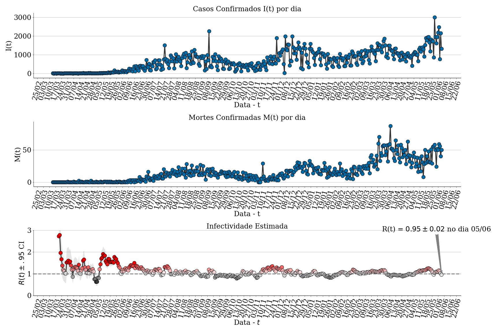
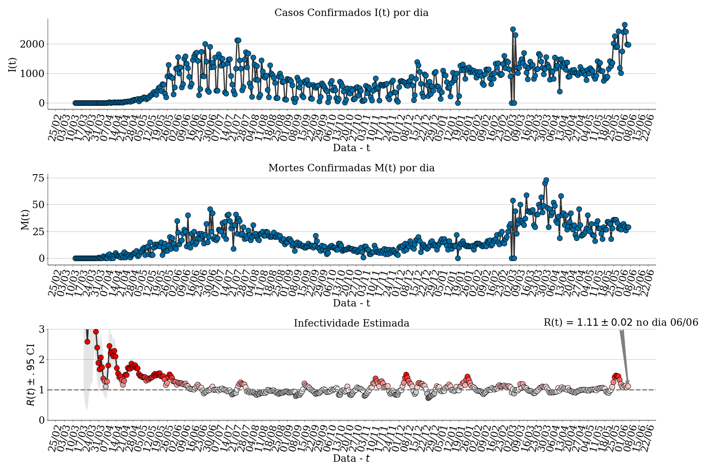
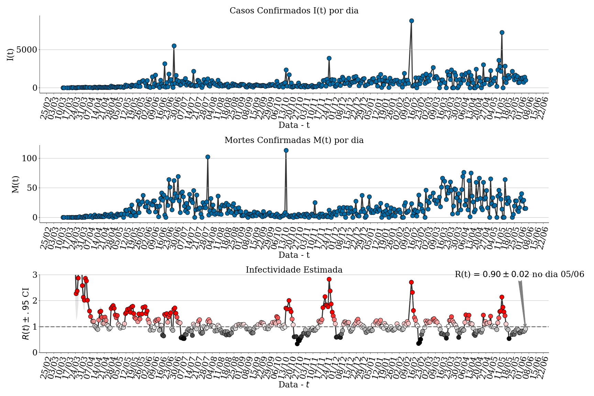
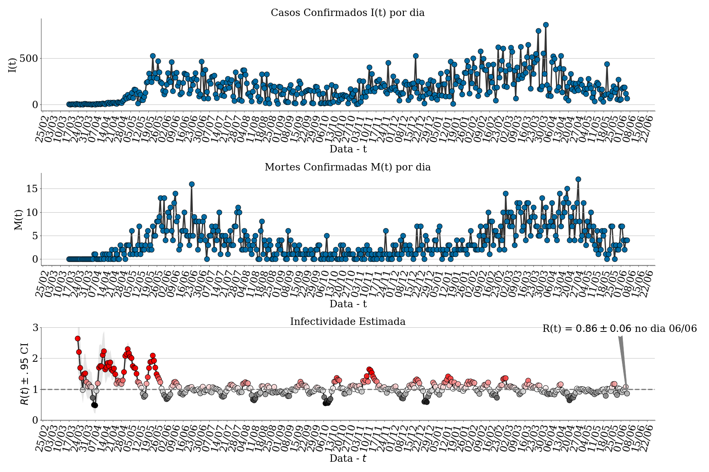
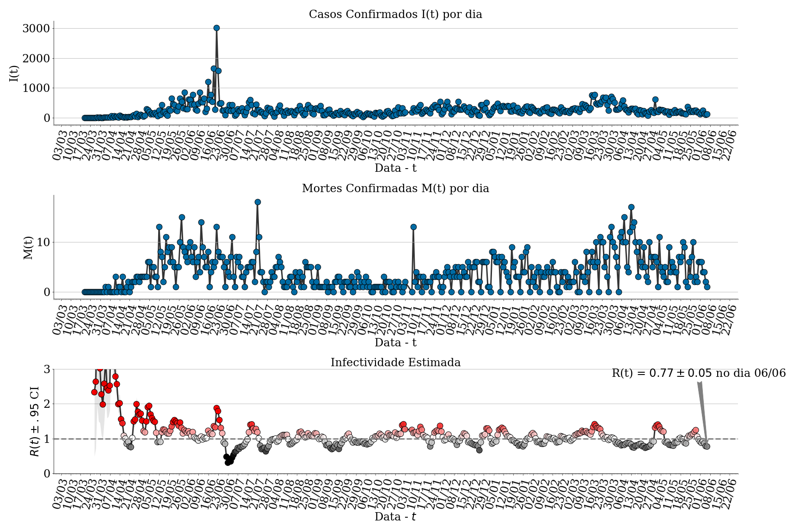
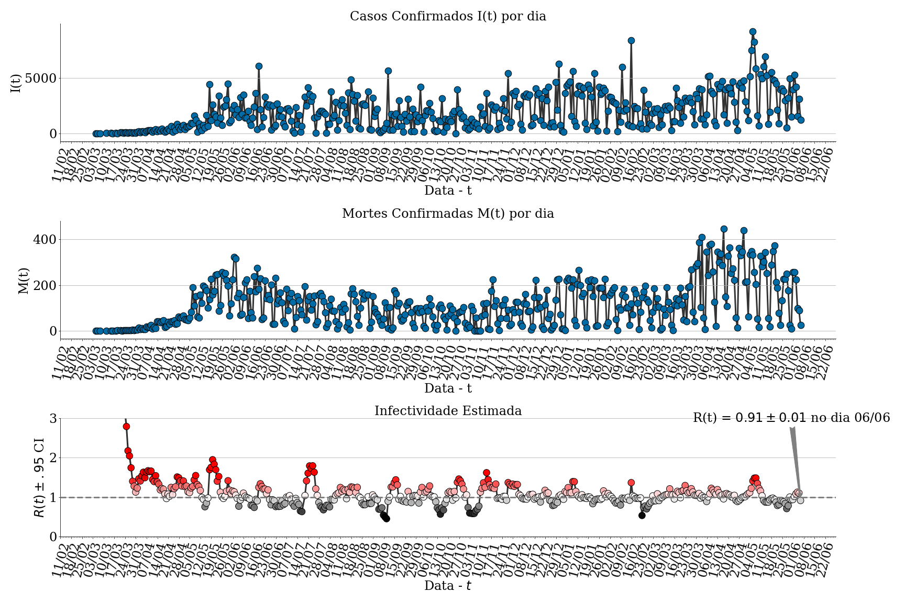
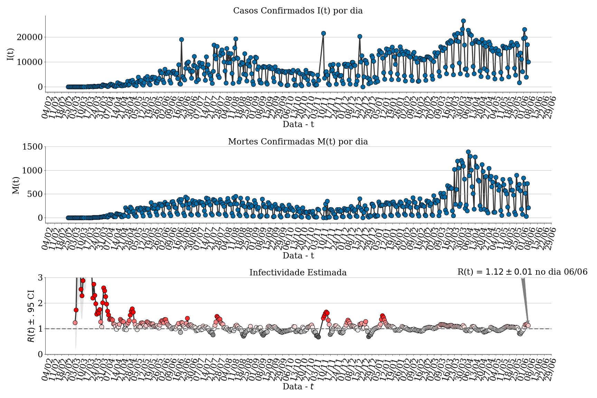
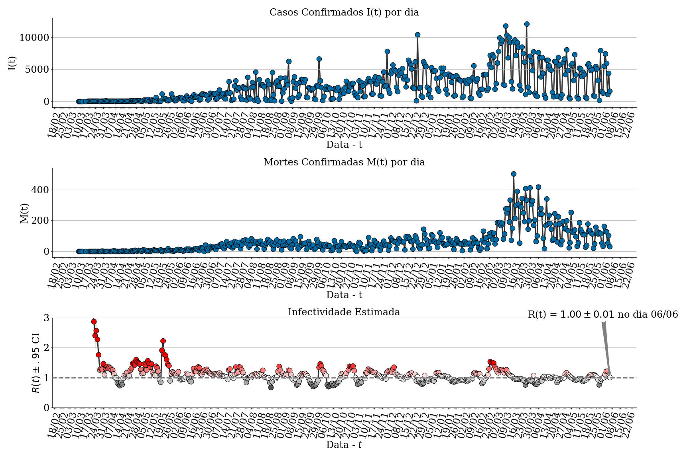

# Estimativas de R0 por Estados do Brasil

| [CentroOeste] | [Nordeste] | [Norte] | [Sudeste] | [Sul] | [Refs] |
|---------------|------------|---------|-----------|-------|--------|
- - -

## Metodologia

Esta página apresenta uma estimativa do número básico de reprodução (R0, pronunciado "R Zero"). O mesmo captura, ou é proporcional ao, número de outras pessoas que um indivíduo infectado vai contagiar. Um número básico de reprodução **R0=2** indica que uma pessoa infectada deve transmitir a doença para outras duas. Portanto, para conter uma doença é importante fazer com que **R0 < 1**, ou seja, na média a doença não se propaga mais entre pessoas.

Os dados foram gerados pelo [Brasil.IO](https://brasil.io) através de esforço coletivo de interpretação dos relatórios da secretária de saúde de cada estado.

O método utilizado é o mesmo que o [Centre for the Mathematical Modelling of Infectious Diseases (CMMID)](https://cmmid.github.io/) faz uso [1]. Aparenta ser o estado da arte. Para fazer uso do método, é necessário estimar uma distribuição de probabilidade que captura o tempo entre casos consecutivos. Isto é, a distribuição captura a probabilidade de um caso **i** infectar outro **j** em um dado intervalo de tempo **x**. [3] Sugere uma distribuição Lognormal com média 4.7 (95% CrI: 3.7, 6.0) e desvio padrão de 2.9 (95% CrI: 1.9, 4.9) dias. É importante ressaltar que outros autores sugerem o uso de outras distribuições como uma Weibull em [1] e Gamma em [4]. No futuro devo postar resultados com tais distribuições.

Para entender um pouco mais sobre o R0 fiz uma vídeo aula. A mesma está abaixo.

Cada gráfico mostra a estimativa do R0 além de um intervalo de credibilidade de 95%. De forma simples, interprete o intervalo como sendo uma faixa de incerteza onde podemos esperar o valor. Sendo o método Bayesiano, o mesmo captura a probabilidade a posteriori do R0 nas amostras geradas.

## CentroOeste

### Distrito Federal

### Goiás

### Mato Grosso do Sul

### Mato Grosso

## Nordeste

### Alagoas

### Bahia

### Ceará

### Maranhão

### Paraíba

### Pernambuco

### Piaui

### Rio Grande do Norte

### Sergipe

## Norte

### Acre

### Amazonas

### Amapá

### Pará

### Roraima

### Tocantins

## Sudeste

### Espirito Santo

### Minas Gerais

### Rio de Janeiro

### São Paulo

## Sul

### Paraná

### Rio Grande do Sul

### Santa Catarina

## Refs

1. Ferretti L, Wymant C, Kendall M et al. Quantifying dynamics of SARS-CoV-2 transmission suggests that epidemic control and avoidance is feasible through instantaneous digital contact tracing. Online First: 2020. doi:https://doi.org/10.1101/2020.03.08.20032946
1. Ma S, Zhang J, Zeng M, et al. Epidemiological parameters of coronavirus disease 2019: a pooled analysis of publicly reported individual data of 1155 cases from seven countries. Online First: 2020. doi:https://doi.org/doi.org/10.1101/2020.03.21.20040329
1. Nishiura H, Linton NM, Akhmetzhanov AR. Serial interval of novel coronavirus (2019-nCoV) infections. medRxiv Published Online First: 2020. doi:https://doi.org/10.1101/2020.02.03.20019497
1. Thompson R, Stockwin J, Gaalen R van et al. Improved inference of time-varying reproduction numbers during infectious disease outbreaks. Epidemics 2019;29:100356. doi:https://doi.org/10.1016/j.epidem.2019.100356

[CentroOeste]: #centrooeste
[Nordeste]: #nordeste
[Norte]: #norte
[Sudeste]: #sudeste
[Sul]: #sul
[Refs]: #sul
